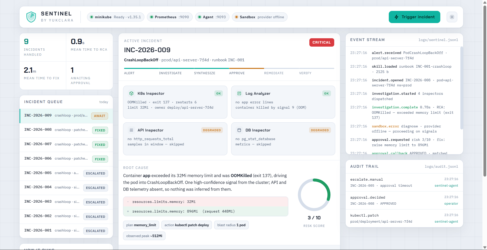
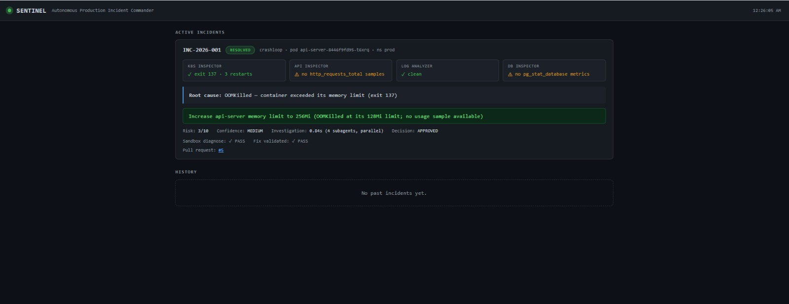
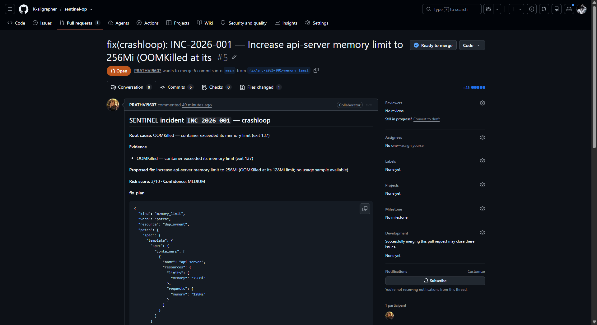
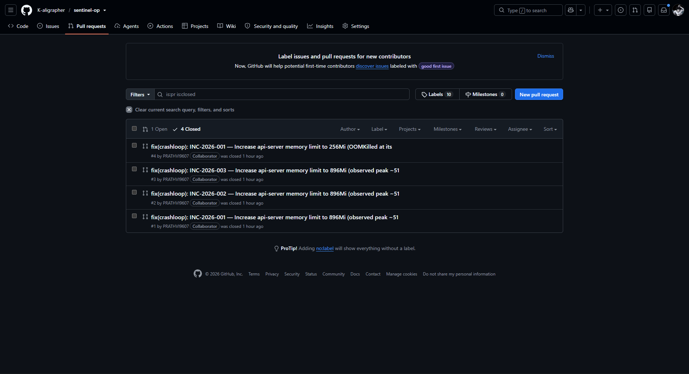
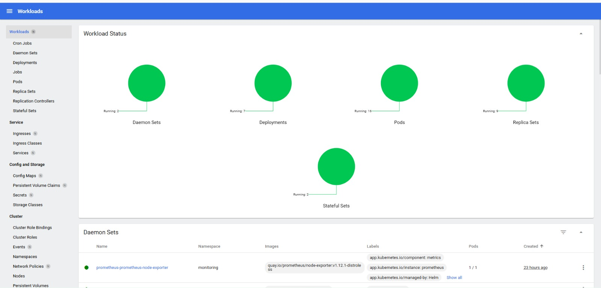

# 🛡️ SENTINEL — Autonomous Production Incident Commander

SENTINEL responds to production incidents without human toil. When Prometheus fires an
alert, SENTINEL spawns **four parallel subagents** to investigate Kubernetes, APIs, logs
and the database simultaneously, runs diagnostics in an **isolated Daytona sandbox**,
synthesizes a root-cause analysis, proposes a **sandbox-validated fix**, and only then
requests **human approval** before touching production. Every incident is **persisted**
for post-mortems and pattern matching.

Built on **TrueForge** (agent harness) with **MCP** servers for real tooling. Every PR is
reviewed by **Qodo**. Code follows the **Ponytail** standard — one expression when one
expression fits.

---

## See it run

▶ **[Watch the 3-minute demo →](https://www.youtube.com/watch?v=xlvv7PteXb0)**


*Operator console (Sentinel by YukClara) — parallel investigation, the live event stream and the immutable audit trail, with the approval gate before anything irreversible.*


*The incident view for a live CrashLoopBackOff (INC-2026-001) — four inspectors, synthesized root cause, sandbox-validated fix, risk score, and the human decision.*


*Every remediation ships as a pull request — RCA, evidence, risk score and the exact `fix_plan` patch, opened by the agent for human review.*


*Pull-request history — each incident SENTINEL closes leaves a reviewed PR behind.*


*The cluster SENTINEL operates on — minikube + kube-prometheus-stack and the demo workload, via the Kubernetes Dashboard.*

> Screenshots live in `docs/media/`. Drop the five PNGs there (or update the paths) before publishing.

---

## Tech stack

| Layer | What we use | Documentation |
|-------|-------------|---------------|
| **Agent harness** | **TrueForge** (TrueFoundry) — runtime, tool routing, parallel sub-agents, session, human-approval UI | [github.com/truefoundry/trueforge](https://github.com/truefoundry/trueforge) · [docs.truefoundry.com](https://docs.truefoundry.com/) |
| **Code review** | **Qodo** — every pull request reviewed before merge | [docs.qodo.ai](https://docs.qodo.ai/) · [Qodo Merge docs](https://qodo-merge-docs.qodo.ai/) |
| **Tool protocol** | **MCP** (Model Context Protocol) | [modelcontextprotocol.io](https://modelcontextprotocol.io/) |
| **MCP servers** | [kubernetes-mcp-server](https://github.com/containers/kubernetes-mcp-server), [github-mcp-server](https://github.com/github/github-mcp-server), [prometheus-mcp](https://www.npmjs.com/package/prometheus-mcp) | linked |
| **Reasoning model** | **Groq** | [console.groq.com/docs](https://console.groq.com/docs) |
| **Code sandbox** | **Daytona** — create → exec → always destroy | [daytona.io/docs](https://www.daytona.io/docs) |
| **Runtime** | Python 3.10+, asyncio, aiohttp, httpx, structlog | [aiohttp](https://docs.aiohttp.org/en/stable/) · [httpx](https://www.python-httpx.org/) · [structlog](https://www.structlog.org/en/stable/) |
| **Cluster + metrics** | minikube, kube-prometheus-stack (Prometheus + Alertmanager), Helm | [minikube](https://minikube.sigs.k8s.io/docs/) · [kube-prometheus-stack](https://github.com/prometheus-community/helm-charts/tree/main/charts/kube-prometheus-stack) · [Helm](https://helm.sh/docs/) |
| **VCS integration** | GitHub REST API | [docs.github.com/rest](https://docs.github.com/en/rest) |
| **Tests** | pytest (unit / integration / e2e) | [docs.pytest.org](https://docs.pytest.org/) |
| **Persistence** | SQLite (WAL) incident store + JSONL audit log | — |

### TrueForge — how it fits

SENTINEL runs entirely inside the [TrueForge](https://github.com/truefoundry/trueforge) harness; the loop, tool calls, sandbox and approval pause are the harness, not our code.

- **Agent + model** — defined in `config/agent.yaml`.
- **MCP connectors** — `config/mcp-connectors.yaml` registers the Kubernetes, Prometheus and GitHub servers; TrueForge brokers every tool call the agent makes.
- **Runbooks as skills** — `skills/INC-00{1,2,3}-*.md`, loaded on demand per incident type.
- **Parallel sub-agents** — the four inspectors (K8s, API, logs, DB) run as concurrent TrueForge sub-agents and their results are merged.
- **Human-in-the-loop** — the approval card (RCA, fix diff, risk score, sandbox result) is rendered by TrueForge's generative UI (`ui/`); the decision returns via `POST /api/v1/approvals/<incident_id>` and unblocks remediation.
- **Session** — incident state survives reconnects.

Docs: [github.com/truefoundry/trueforge](https://github.com/truefoundry/trueforge) · [docs.truefoundry.com](https://docs.truefoundry.com/) · run it with `npx @truefoundry/trueforge`.

### Qodo — how it fits

Code review is part of the build: every substantive change merges through a GitHub pull request reviewed by [Qodo](https://www.qodo.ai/) before a human merges it.

- Installed on the repo on day one (Integrations → SaaS → GitHub).
- Branch → PR → Qodo review → decision → follow-up review → human merge.
- Every valid **High**-severity finding is fixed; anything dismissed is recorded with a reason in the Qodo thread.
- Qodo's whole-repo understanding caught cross-file issues in the `kubectl` apply path and the approval state machine that a diff-only review would miss.

Docs: [docs.qodo.ai](https://docs.qodo.ai/) · [Qodo Merge docs](https://qodo-merge-docs.qodo.ai/). See **Qodo Code Review Evidence** below.

---

## Repository layout

```
sentinel/
├── agent/
│   ├── main.py                 # entry point — validates env, starts alert listener
│   ├── core/
│   │   ├── orchestrator.py     # investigate() + Orchestrator (webhook + lifecycle)
│   │   ├── aggregator.py       # merge 4 subagent results, flag degraded ones
│   │   └── rca_synthesizer.py  # signals → root cause + proposed fix + risk score
│   ├── subagents/
│   │   ├── k8s_inspector.py    # kubectl describe / top / events
│   │   ├── api_inspector.py    # Prometheus error rate / p99 / rps
│   │   ├── log_analyzer.py     # previous-container log signature scan
│   │   ├── db_inspector.py     # connection pool / slow queries / replication lag
│   │   └── _prom.py            # shared PromQL helpers
│   └── utils/{retry.py,circuit_breaker.py}
├── tools/
│   ├── sandbox_executor.py     # Daytona: create → exec → ALWAYS destroy
│   ├── approval_handler.py     # callback / file / auto providers + timeout → escalate
│   ├── github_pr.py            # open a PR (branch + incident note) after an approved fix
│   ├── escalation.py           # Slack notify + ERROR log
│   └── sentinel_logger.py      # structlog JSON + secret masking
├── session/
│   ├── incident_store.py       # SQLite (WAL) incident history + next_incident_id()
│   ├── pattern_matcher.py      # similar past incidents (returns [] never None)
│   └── history_reader.py       # human-readable renderings
├── security/{secrets.py,input_sanitizer.py,audit_logger.py}
├── skills/INC-00{1,2,3}-*.md   # TrueForge runbooks
├── config/                     # agent.yaml, alert-rules.yaml, mcp-connectors.yaml
├── mcp/                        # per-server MCP config / env
├── ui/                         # TrueForge dashboard + generative-UI templates
├── deploy/                     # docker-compose, k8s RBAC, Helm chart
├── scripts/                    # trigger_alert.py, verify_infra.py, verify_mcp.py, diagnostics/
├── tests/{unit,integration,e2e}/
└── docs/                       # demo script, blog post, API, PR checklist
```

---

## Quick start (local)

```bash
cd sentinel
python -m venv .venv && source .venv/bin/activate     # Windows: .venv\Scripts\activate
pip install -r requirements.txt
cp .env.example .env                                   # fill GROQ / GITHUB / DAYTONA keys

# infra (see docs/demo-script.md for the full sequence)
minikube start --memory=4096 --cpus=4
helm install prometheus prometheus-community/kube-prometheus-stack -n monitoring --create-namespace
kubectl apply -f /tmp/k8s-scenarios/scenarios/crashloopbackoff/issue.yaml

# run the agent
python -m agent.main                                   # listens on :9093

# in another shell — fire a mock alert
python scripts/trigger_alert.py crashloop
```

### Approving a proposed fix

`SENTINEL_APPROVAL_MODE` selects how the human decides:

| Mode | How to approve |
|------|----------------|
| `callback` (default) | `POST /api/v1/approvals/<incident_id>` with `{"decision":"APPROVED"}` — this is the TrueForge UI callback; the agent also posts an approval card to `TRUEFORGE_URL`. |
| `file` | `echo APPROVED > logs/approvals/<incident_id>.decision` (or `REJECTED`) |
| `auto` | unattended — reads `SENTINEL_AUTO_DECISION` (default `APPROVED`) |

Any mode escalates on `APPROVAL_TIMEOUT_MINUTES`. After an approved fix, if `GITHUB_TOKEN`
+ `GITHUB_REPO` are set (and `SENTINEL_OPEN_PR != 0`), SENTINEL opens a PR with the RCA
and `fix_plan`.

---

## Bring up the full demo stack

Windows (Docker Desktop running, `.env` filled in):

```powershell
.\scripts\start_stack.ps1          # Minikube + Prometheus + demo pod + MCP servers + TrueForge
python -m agent.main
python scripts\trigger_alert.py crashloop
.\scripts\stop_stack.ps1           # tear down (add -DeleteCluster to remove Minikube)
```

Or the container-only slice:

```bash
docker compose -f deploy/docker-compose.yml up --build
```

---

## Tests

```bash
pytest tests/unit -v                       # offline, no infra
RUN_INTEGRATION=1 pytest tests/integration  # needs MCP servers / Daytona
pytest -m e2e tests/e2e                     # full lifecycle
```

---

## Incident types covered (v1.0)

| Type | Alert | Runbook |
|------|-------|---------|
| CrashLoopBackOff | `PodCrashLoopBackOff` | `skills/INC-001-crashloop.md` |
| High API error rate | `HighAPIErrorRate` | `skills/INC-002-api-errors.md` |
| DB connection timeout | `DBConnectionTimeout` | `skills/INC-003-db-timeout.md` |

Non-goals for v1.0: cloud K8s, >3 incident types, multi-cluster, real PagerDuty,
auto-merge without approval. See `SENTINEL_PRD.md` §2 and `docs/technical-debt.md`.

---

## Safety guarantees

- All diagnostic / fix code runs in Daytona — **never** on the host or production.
- Every production change requires **human approval**; timeout → **escalation**, never silent apply.
- `security/input_sanitizer.py` blocks dangerous shell patterns and non-read-only `kubectl`.
- Secrets are masked in every log line; `security/audit_logger.py` records every action.
- K8s access via a minimal-permission ServiceAccount (`deploy/k8s-manifests/rbac.yaml`).

---

## Qodo Code Review Evidence

Every substantive change was merged through a pull request reviewed by Qodo before a human merged it — no direct pushes to `main`.

- **Representative PR:** [#5 — fix(crashloop): INC-2026-001 memory-limit patch](https://github.com/K-aligrapher/sentinel-op/pull/5) <!-- swap for your strongest merged PR -->
- **What Qodo surfaced / what we did:** _<one or two sentences — e.g. "Qodo flagged that the approval future could resolve after the fix was already applied; we reordered the apply/verify steps and added a regression test. One High finding on a test fixture was dismissed with a reason in the thread."_>
- **PR history:** [all pull requests](https://github.com/K-aligrapher/sentinel-op/pulls?q=is%3Apr) — each shows the completed Qodo review, our decisions, and a follow-up review against the final code.
